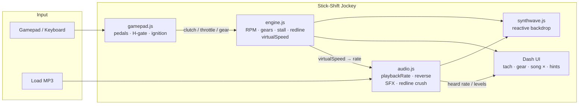

# stick-shift Jockey

## Basic Details
### Team Name: shafeeh bin shakkir

### Team Members
- Team Lead: shafeeh bin shakkir - SCMS SCHOOL OF ENGINEERING AND TECHNOLOGY

### Project Description
makes listening to music more fun by adding gaming experience,visual experience,and even driving experience perhaps?

### The Problem (that doesn't exist)
people often just turn on their favourite music and just leaves it on and does other tasks 
leaving their favourite music attentionless and alone
### The Solution (that nobody asked for)
here, nuh uh they gotta pay full attention
they are supposed to maintain the music speed to be audible level by manualy shifting gears like in an actual manual trnasmission vehicle with a 5-speed gear box
gamepad/controller recommended for best experience

## Technical Details
### Technologies/Components Used
For Software:
Languages: HTML, CSS, JavaScript (ES modules)
Frameworks: none (vanilla front-end)
Libraries: Tailwind CSS (CDN)
Browser APIs: Web Audio API, Gamepad API, Canvas 2D, HTMLMediaElement / AudioBuffer
Tools: any static HTTP server (Live Server, npx serve, Python http.server, etc.) — no build step, no npm install

### Implementation
For Software:
# Installation
git clone https://github.com/shafeehshakkir/stick-shift_jockey.git
cd stick-shift_jockey

# Run
[commands]

### Project Documentation
For Software:

# Screenshots (Add at least 3)

this is the landing page also the dashboard which shows the song details and playback details

this is the gamepad debugger

hitting redline

# Diagrams

### Project Demo
# Video

](https://drive.google.com/file/d/1srtDDI3dVz-bUKtkfAjVLRkaLJJyfjDz/view?usp=sharing)
basic guide of how to use it a controller/gamepad is recommended

---
Made with ❤️ at TinkerHub Useless Projects 

